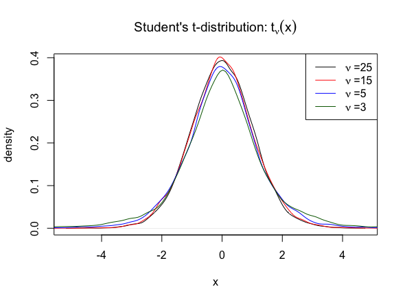
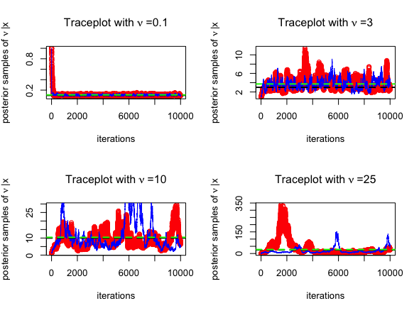
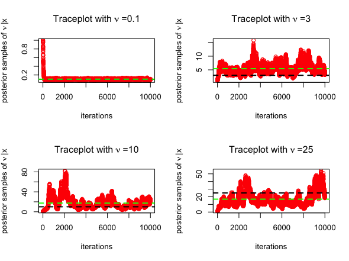
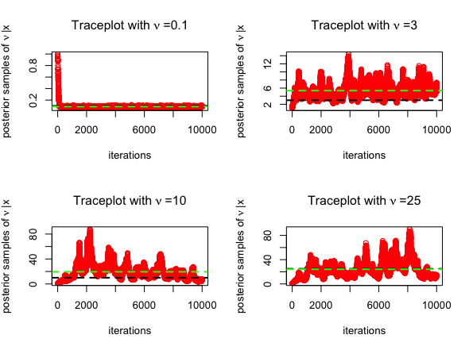
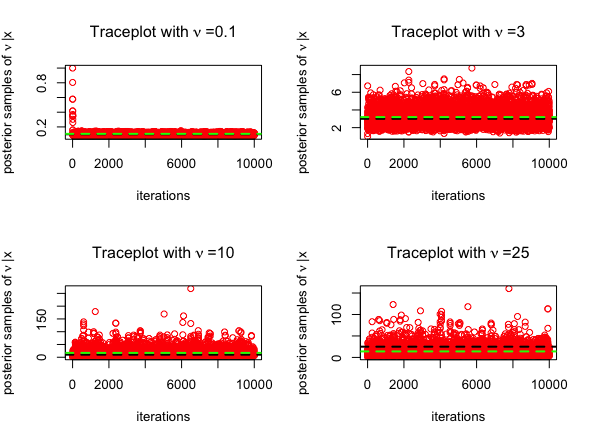

## **`bayesestdft`**: *Estimating the degrees of freedom of the Student's t-distribution under a Bayesian framework*

## Contents

-   [Overview](#overview)
-   [Installation](#installation)
-   [Goal](#goal)
-   [Jeffreys prior](#jeffreys-prior)
-   [Exponential prior](#exponential-prior)
-   [Gamma prior](#gamma-prior)
-   [Log-normal prior](#log-normal-prior)
-   [Real-Data study](#real-data-study)

## Overview

`bayesestdft` is an R package providing tools to implement **Bayesian estimation** of the **degrees of freedom** in the **Student's t-distribution**, that are developed in [Lee (2022)](https://doi.org/10.3390/axioms11090462). Estimation experiments are run both on simulated as well as real data, where broadly three *Markov Chain Monte Carlo* (**MCMC**) sampling algorithms are used: (i) *random walk Metropolis* (**RMW**), (ii) *Metropolis-adjusted Langevin Algorithm* (**MALA**) and (iii) *Elliptical Slice Sampler* (**ESS**) respectively, to sample from the posterior distribution of the degrees of freedom.

The current version of the package `bayesestdft 1.0.0` provides Bayesian routines to estimate the degrees of freedom of the Student's t-distribution with **Jeffreys** prior (`BayesJeffreys`), **Gamma** prior (`BayesGA`), and **Log-normal** prior (`BayesLNP`) endowed upon as the prior distribution over the degrees of freedom. **MALA** is used to draw posterior samples in case of the Jeffreys prior, hence to operate the function `BayesJeffreys`, the user needs to install the `numDeriv` R package. For more technical insights into `bayesestdft`, refer to the [slides](https://github.com/yain22/bayesestdft/blob/master/doc/Explaining%20R%20Package%20bayesestdft.pdf).

## Installation Guide for `bayesestdft`

-   An R version of **4.0.4**, or higher is required to install `bayesestdft`.
-   **Core dependencies** include `numDeriv` and `dplyr`.

Now `bayesestdft` can be installed from both **Github** and **CRAN** respectively, using the following lines of code:

1.  **Github Installation**

``` r
library(devtools)
devtools::install_github("Roy-SR-007/bayesestdft")
library(bayesestdft)
```

2.  **CRAN Installation**

``` r
install.packages("bayesestdft")
library(bayesestdft)
```

## Goal {#goal}

`bayesestdft` facilitates a **full Bayesian framework** for the **estimation** of the **degrees of freedom** in the **Student's t-distribution**. More precisely, given $N$ independent and identical samples $x = (x_1,x_2, \cdots, x_N)$ from the Student's t-distribution:

$$ 
t_{\nu}(x) = \frac{\Gamma\left( \frac{\nu+1}{2} \right)}{\sqrt{\nu \pi} \Gamma\left( \frac{\nu}{2} \right)} \left(1 + \frac{x^2}{\nu} \right)^{-\frac{\nu +1}{2}}, \quad x \in \mathbb{R}
$$



and a prior distribution $\pi(\nu)$ over the degrees of freedom $\nu$, the aim is to sample from the posterior distribution:

$$
\pi(\nu|\textbf{x}) = \frac{\left[\prod_{i=1}^{N} t_{\nu}(x_i) \right]\cdot \pi(\nu)}{\int_{\mathbb{R}^{+}} \left[\prod_{i=1}^{N} t_{\nu}(x_i)\right] \cdot \pi(\nu) d\nu}, \quad \nu \in \mathbb{R}^+
$$

The current version of the package `bayesestdft 1.0.0`, provides **four prior choices** $\pi(\nu)$ viz., the **Jeffreys** prior $\pi_J(\nu)$, an **exponential** prior $\pi_E(\nu)$, a **gamma** prior $\pi_G(\nu)$, and a **log-normal** prior $\pi_L(\nu)$.

## Jeffreys prior [(Fonseca et al. (2008))](https://academic.oup.com/biomet/article-abstract/95/2/325/230123) {#jeffreys-prior}

$$ \pi_{J}(\nu) \propto \left(\frac{\nu}{\nu+3} \right)^{1/2} \left( \psi'\left(\frac{\nu}{2}\right) -\psi'\left(\frac{\nu+1}{2}\right) -\frac{2(\nu + 3)}{\nu(\nu+1)^2}\right)^{1/2},\quad \nu \in \mathbb{R}^+$$

where $\psi(a) = \frac{d\log\Gamma(a)}{da}$ and $\psi'(a) = \frac{d\Psi(a)}{da}$ are the **digamma** and **trigamma** functions respectively, which are computed using the R functions `digamma()` and `trigamma()` in the `base` package.

#### Estimation of the degrees of freedom from simulated data using `BayesJeffreys`

We consider $N=100$ simulated observations $x = (x_1, x_2, \cdot, x_N)$ from $t_{0.1}$ distribution, where the degrees of freedom is $\nu = 0.1$. We estimate $\nu$ using the **Jeffreys** prior and consider posterior samples from both **RMW** and **MALA** MCMC sampling engines. The corresponding R code for using the function `BayesJeffreys()` to sample from the posterior with a **Jeffreys** prior over the degrees of freedom $\nu$ is:

``` r
x = rt(n = 100, df = 0.1)

# simulating S = 10000 posterior samples
nu1 = BayesJeffreys(x, S = 10000, sampling.alg = "MH")
nu2 = BayesJeffreys(x, S = 10000, sampling.alg = "MALA")
# posterior mean estimate from the RMW algorithm
mean(nu1)
# posterior mean estimate from the MALA sampling scheme
mean(nu2)
```

The **trace plots** for MCMC algorithms (posterior samples obtained from **RWM** in [red]{style="color:red"} and those obtained from **MALA** in [blue]{style="color:blue"}) are given below, for $\nu = 0.1, 3, 10, 25$. The **posterior mean** is highlighted in [green]{style="color:green"} below.



## Exponential prior [(Fernández and Steel (1998))](https://doi.org/10.1080/01621459.1998.10474117) {#exponential-prior}

$$ \pi_{E}(\nu) =Ga(\nu|1,0.1) = Exp(\nu|0.1) = \frac{1}{10} e^{-\nu/10},\quad \nu \in \mathbb{R}^+$$

where the rate hyper-parameter has been set to $0.1$ following [Fernández and Steel (1998)](https://doi.org/10.1080/01621459.1998.10474117).

#### Estimation of the degrees of freedom from simulated data using `BayesGA`

Once again, we consider $N=100$ simulated observations $x = (x_1, x_2, \cdot, x_N)$ from $t_{0.1}$ distribution, where the degrees of freedom is $\nu = 0.1$. We estimate $\nu$ using the **Exponential** prior and consider posterior samples from **RMW** MCMC scheme. Following is the R code for using the function `BayesGA()`:

``` r
x = rt(n = 100, df = 0.1)

# simulating S = 10000 posterior samples
nu = BayesGA(x, S = 10000, a = 1, b = 0.1)
# posterior mean estimate
mean(nu)
```

The **trace plots** for MCMC algorithm (posterior samples obtained from **RWM** in [red]{style="color:red"}) are given below, for $\nu = 0.1, 3, 10, 25$. The **posterior mean** is highlighted in [green]{style="color:green"} below.



## Gamma prior [(Juárez and Steel (2010))](https://doi.org/10.1198/jbes.2009.07145) {#gamma-prior}

$$ \pi_{G}(\nu) =Ga(\nu|2,0.1) =\frac{\nu}{100} e^{-\nu/10},\quad \nu \in \mathbb{R}^+$$

where the shape and rate hyper-parameters are set to $2$ and $0.1$ respectively, as recommended by [Juárez and Steel (2010)](https://doi.org/10.1198/jbes.2009.07145).

#### Estimation of the degrees of freedom from simulated data using `BayesGA`

The `BayesGA()` function is implemented with the same configuration as above in case of the **Exponential** prior with a slight generalization of inducing a **Gamma** prior over $\nu$. To what follows, is the R code for using `BayesGA()` under the Gamma prior set up with posterior sampling being done using the **RWM** scheme:

``` r
x = rt(n = 100, df = 0.1)

# simulating S = 10000 posterior samples
nu = BayesGA(x, S = 10000, a = 2, b = 0.1)
# posterior mean estimate
mean(nu)
```

The **trace plots** for MCMC algorithm (posterior samples obtained from **RWM** in [red]{style="color:red"}) are given below, for $\nu = 0.1, 3, 10, 25$. The **posterior mean** is highlighted in [green]{style="color:green"} below.



## Log-normal prior {#log-normal-prior}

The **Log-normal** prior has been suggested as a viable option in [Lee (2022)](https://doi.org/10.3390/axioms11090462) with the choice of mean and variance hyper-parameters as $1$, a justification to which has been provided through the sensitivity analysis done in **Section 4.1** of [Lee (2022)](https://doi.org/10.3390/axioms11090462).

$$ \pi_{L}(\nu) =logN(\nu|1,1) =\frac{1}{\nu \sqrt{2\pi}} \exp\left[- \frac{(\log \nu - 1)^2}{2} \right],\quad \nu \in \mathbb{R}^+$$

#### Estimation of the degrees of freedom from simulated data using `BayesLNP`

The `BayesLNP()` function draws posterior samples using the *Elliptical Slice Sampler* (**ESS**), considering a **Log-normal** prior over the degrees of freedom $\nu$, and the R code for its implementation is given below:

``` r
x = rt(n = 100, df = 0.1)

# simulating S = 10000 posterior samples
nu = BayesLNP(x, S = 10000)
# posterior mean estimate
mean(nu)
```

The **trace plots** for MCMC algorithm (posterior samples obtained from **ESS** in [red]{style="color:red"}) are given below, for $\nu = 0.1, 3, 10, 25$. The **posterior mean** is highlighted in [green]{style="color:green"} below.



## Real-Data study {#real-data-study}

## References

[1] [Se Yoon Lee. (2022) "The Use of a Log-Normal Prior for the Student t-Distribution," Axioms](https://www.mdpi.com/2075-1680/11/9/462)
